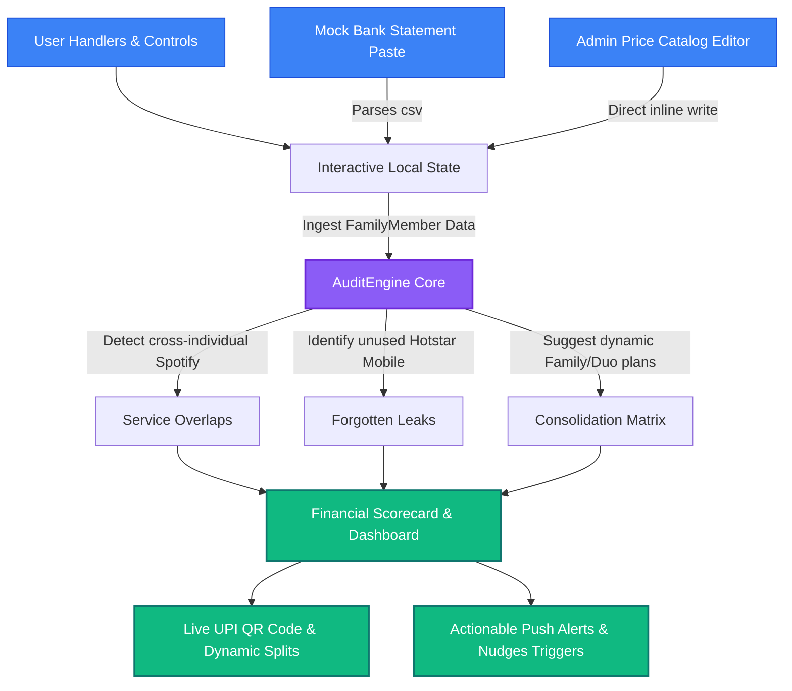

# SubAudit 🇮🇳  
### Smart Subscription Optimizer & E-Mandate Audit Ledger for Indian Households

SubAudit helps families identify silent financial leakages under the RBI's auto-debit rules by scanning bank statement statements, de-duplicating cross-member accounts, and calculating optimal group shares with dynamic UPI visual splits.

---

## 🛠️ Key Dynamic Features Implemented

### A) 🏦 Connected Accounts: Bank Statement CSV Scanner
- **Dynamic Parsing:** Ingests e-mandate rows securely. Supports drag-and-drop & copy-pasting of transaction rows in standard CSV/TSV format.
- **Auto-Debits Detection:** Matches standard merchant strings (Netflix, Spotify Premium, GCloud storage, Disney+ Hotstar) and parses costs under ₹5,000 RBI auto-debit limits.
- **Household Injection:** Injects discovered items securely into any chosen family member's ledger, triggering a full recalc in real-time.

### B) 🔔 push/Email Renewals Alerts (Smart Nudges)
- **Warning Notifications:** Preloaded with reminders (e.g., *"A new ₹149 auto-debit started on your account 3 days before renewal — review it."*).
- **Consolidated Fix-it Portals:** Action-oriented notification tray allows you to immediately **"Terminate Ghost Auto-Debit"**, updating the family budget scorecard live.
- **Simulate live Alerts:** Added a dedicated **"Simulate Nudge"** controller button at the top banner to demonstrate push alerts mid-presentation easily.

### C) 🛠️ Local Price Catalog Reference Admin
- **No-Code Editing:** Visual, code-free administration modal of the database of OTT, Music, and Cloud price standards in India.
- **Instant Propagation:** Modify standard rates or create a dynamic plan entirely inside the UI. New additions immediately show up inside the dashboard "Add Subscription" options.

---

## 📐 Architecture Diagram (Mermaid)



---

## ⚡ 60-Second Hackathon Click-Path Live Demo Guide

Follow this precise script during your pitch to stun judges with a fully cohesive loop:

1. **The Landing Page:** Showcase the warm display typography and click **"Audit Our Household Leaks"** (with beautiful smooth slide animations).
2. **The Scanning Screen:** Experience the sandbox simulation parsing Aadhaar-safe client logs and Otp-less mandates.
3. **The Reveal Screen:** Marvel at the animated counter landing on the reveal that the family is losing **₹850/mo** in redundant leakages.
4. **The Dashboard Screen:**
   - Look at the top center bell icon: click it to show preloaded duplicates.
   - Click **"Simulate Nudge"** on the Top Developer Banner: see a real-time smart pop-up warning you of a ghost auto-debit renewal. Let the judges see it slide down!
   - Click **"Terminate Ghost Auto-Debit"** inside that notification nudge: notice how Neha's Hotstar automatically disappears, saving the family ₹149/mo immediately!
   - Go to the **"Statement CSV"** button on the Top Developer Banner. Click any preloaded Template (like HDFC or ICICI), select Priya, and hit **"Import Selected Mandates"**: watch the audit engine recompute the household ledger stats dynamically.
   - Go to the **"Price Catalog"** button: change Spotify's price or add custom plans, and show how it affects the add-subscriptions modal without touching code.
   - Scroll down to **"Quick Wins"**: click **"Fix This"** on Spotify to merge Rahul and Priya's accounts, then check the **"Success Fee Payment"** screen and dynamic **"UPI QR Code splits"**!
5. **Pitch Stats:** Click **"Pitch Stats"** on the top developer banner to copy clean markdown presentation notes ready to paste into your slidedeck!

---

## 🚀 Setting Up & Running Locally

Ensure Node.js 18+ is installed.

```bash
# 1. Clone the project and open workspace directory
cd subaudit-sandbox

# 2. Install base React & Vite packages
npm install

# 3. Spin up local live HMR development server
npm run dev
```

*Runs automatically on http://localhost:3000.*  
The code is built entirely in **TypeScript** using **Tailwind CSS** utilities and **Motion** animations.
